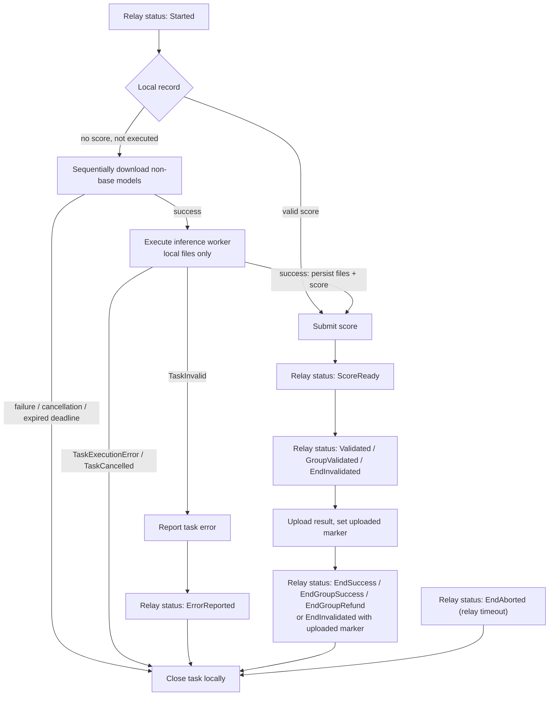

# Task Lifecycle

This document specifies the business-level lifecycle of an inference task on the node: the condition-to-action rules the reconcile loop applies at each relay task status, and all failure outcomes. The reconcile loop itself, the worker manager, and all non-protocol failure handling (worker restarts, relay communication failures, exception containment) are specified in `docs/task-system-design.md`. How the node observes relay state and recovers after a restart is specified in `docs/state-tracking.md`. The independent failure diagnostic channel is specified in `docs/task_error_report.md`.

## 1) Error Classification

Task execution failures are classified into exactly two categories:

- **`TaskInvalid`**: the task itself is at fault. Every node executing this task fails the same way. This classification is derived from the worker error traceback and covers invalid task arguments only.
- **`TaskExecutionError`**: every other failure, including a foreground model-download failure, foreground download cancellation, expired foreground download deadline, CUDA errors, out-of-memory errors, missing models, and any unclassified exception. Responsibility cannot be attributed to the task, so it is treated as a node-local failure of unknown cause.

Before inference, `TaskReconciler` MUST derive every non-base model from the authoritative `task.model_ids` and download those models sequentially through task-scoped foreground jobs. The inference worker MUST continue to load every model from the local cache only (`local_files_only`) and MUST NOT download models. A base model absent from the local cache, or a non-base model still absent after its foreground job succeeds, fails inference with the `Task model not downloaded` error. The node therefore does not report `TaskInvalid` for invalid model identifiers; download failures and cache misses become `TaskExecutionError` and end through the relay timeout, the always-safe silent path. The `Task model not downloaded` traceback additionally suppresses the inference worker restart, as specified in `docs/task-system-design.md`; its protocol handling is identical to every other `TaskExecutionError`.

The classification boundary is protocol-critical because of validation groups:

- A task MAY be part of a hidden 3-node validation group. The node cannot detect group membership at execution time.
- If the node reports a task error while the other two nodes in the group submit matching scores, the node's task ends `EndInvalidated` and the node is **slashed**.
- If the node stays silent and the task times out, the node only receives a QoS health penalty and loses the task fee. Timeouts never cause slashing.

Therefore:

- The node MUST call `report_task_error` on the relay if and only if the failure is classified as `TaskInvalid`.
- The node MUST NOT report a task error for any `TaskExecutionError`. The conservative path for these failures is to remain silent and let the task reach a terminal status through the relay-side timeout, accepting the QoS penalty.
- Diagnostic persistence and `POST /v2/tasks/:task_id_commitment/node_error` MUST NOT count as a protocol Task error report. `TaskInvalid` MUST continue through the existing `report_task_error` protocol action in addition to diagnostic capture. Every other diagnostic type MUST retain the existing silent timeout behavior.

## 2) Reconcile Conditions and Actions

Each reconcile cycle derives at most one action from the fresh relay task status and the local task record. The local task record consists of the persisted artifacts (result files, score, checkpoint, result-uploaded marker) and the process-local execution outcome of the current worker lifetime.

| Relay status | Local condition | Action |
|--------------|-----------------|--------|
| `Started` / `ParametersUploaded` | no valid score, not yet executed in this worker lifetime | Download the task's non-base models, then execute inference |
| `Started` / `ParametersUploaded` | execution outcome is `TaskInvalid`, error not yet reported | Report the task error to the relay |
| `Started` / `ParametersUploaded` | execution outcome is `TaskExecutionError` or `TaskCancelled` | Close the task locally (see section 3) |
| `Started` / `ParametersUploaded` | valid score persisted | Submit the score |
| `ScoreReady` | — | None; wait for validation |
| `Validated` / `GroupValidated` / `EndInvalidated` | result-uploaded marker not set | Upload the result; set the marker on success |
| `EndSuccess` / `EndGroupSuccess` / `EndGroupRefund` / `EndAborted` | — | Close the task locally |
| `EndInvalidated` | result-uploaded marker set | Close the task locally |
| `ErrorReported` | error report acknowledged | Close the task locally |

Closing a task locally persists its final status and releases its local resources. A closed task produces no further actions.

The relay sets the node's current-task pointer in the same transaction that sets the task to `Started`, so the pointer never exposes a `Queued` task to the loop.

### Execution outcomes

- **Success**: all required foreground downloads and inference completed. The result files and score MUST be persisted in the local task record before score submission is attempted. No code path is allowed to re-invoke the worker for a task whose local record already contains a valid score.
- **`TaskInvalid`**: the loop reports the task error to the relay. Score submission MUST NOT be attempted afterwards. The task converges when a later cycle observes `ErrorReported` and closes it.
- **`TaskExecutionError`**: the loop logs the failure and closes the task locally. This includes foreground download failure, cancellation, and deadline expiry. Inference MUST NOT start after a foreground download failure. The loop MUST NOT report a task error and MUST NOT re-execute. The task remains `Started` on the relay and is aborted by the relay's timeout processor; worker recovery is the worker manager's responsibility and happens independently.
- **`TaskCancelled`** (the execution future was cancelled by a worker restart): handled exactly like `TaskExecutionError`: log and close locally, without reporting a task error. A cancelled execution MUST NOT trigger another worker restart.
- **Diagnostic capture**: before closing a failed local execution, the reconciler MUST persist the original Worker traceback for `TaskInvalid` and `TaskExecutionError`, the complete chained exception for a foreground download failure, or the reasoned no-traceback explanation for cancellation. Runner version synchronization, background pre-download, and whole-process shutdown MUST NOT create a Task diagnostic. Diagnostic capture failure MUST NOT change the execution outcome or protocol action.

### Foreground download phase

- The reconciler MUST use `task.model_ids` from the current authoritative Relay task record. It MUST select every identifier that does not begin with `base:` and MUST preserve their order.
- The reconciler MUST send one task-scoped `DownloadTaskInput` at a time to the serial download worker and MUST await success before sending the next job.
- Every foreground download job MUST carry the Relay task deadline, calculated as `start_time + timeout`. The inference execution grace period MUST NOT be added to this deadline.
- The server MUST NOT inspect the Hugging Face cache before dispatch. The download worker MUST make the operation idempotent for models already present.
- If the deadline is already expired, the reconciler MUST classify execution as `TaskExecutionError` without dispatching inference. If an enqueued or running foreground download reaches the deadline without a worker-reported result, the download worker manager MUST restart the download worker and cancel the wait. That cancellation MUST become `TaskExecutionError`.
- A foreground download MUST NOT create persistent background download state and MUST NOT report model completion to the Relay.

### One-shot execution

- The node MUST execute the complete foreground-download and inference sequence at most once per worker process lifetime. Local re-execution after a failure is forbidden within one worker lifetime: the failure is deterministic for this node, and the application-side redundancy (bridge repeat tasks) already covers cross-node retries.
- After a node restart the worker process is new, so a recovered non-terminal task without a persisted score is executed again. A recovered task with a persisted score skips execution entirely.

## 3) Convergence Rules

- A failed state-changing request (report error, submit score, upload result) advances nothing: the cycle ends with a log entry and the next cycle re-derives the action from fresh state. If the first request was applied and only its response was lost, the next cycle observes the already-applied status (`ErrorReported`, `ScoreReady` or later, or a post-upload status) and proceeds; the rejected duplicate needs no resolution logic.
- `EndInvalidated` does not change after the result upload, so upload completion for it is recorded solely by the local result-uploaded marker.
- A relay response that authoritatively states the task does not exist closes the task locally as `EndAborted`.
- A task closed locally as failed (`TaskExecutionError` / `TaskCancelled` path) stays closed. The relay's current-task pointer still refers to it until the relay-side timeout abort; the loop derives no action for a closed task.

## 4) Task Timeout

The relay is the sole authority for timing out tasks:

- The relay's timeout processor aborts every non-terminal task whose `start_time + timeout` has passed, setting it to `EndAborted` with reason `Timeout`, with retry and race protection on its side. The scan period is a few seconds, so the abort lands shortly after the deadline.
- The node MUST NOT call the relay abort endpoint. The node observes the timeout as a normal status transition to `EndAborted` and closes the task locally like any other terminal status.
- Foreground model downloads MUST use this same deadline. Missing it MUST stop local execution before inference, restart the download worker when the missed deadline belongs to a queued or running download job, and leave the node silent until the Relay timeout closes the task.

Node-issued timeout aborts are a legacy of the old blockchain-based protocol: task dispatching lived on chain, no on-chain timer could end a timed-out task, so the abort had to be triggered by the node. The current relay owns the timeout clock, which makes a node-issued abort redundant — by the time a node-side timeout could fire, the relay has already aborted the task.

If the relay is unreachable, the loop derives no actions (a failed poll ends the cycle), so an unreachable relay can never cause a protocol action based on stale state. The task converges when connectivity returns and a fresh poll observes the relay's authoritative status.

## 5) The `ParametersUploaded` Status

`ParametersUploaded` is a legacy relay status from the old blockchain-based protocol, where a task was first created on chain (becoming `Started`) and its parameters were uploaded to the relay in a separate later step. In the current protocol, the task creator uploads the task parameters in the task creation request itself, and the relay dispatcher moves the task directly from `Queued` to `Started`. The current relay never sets a task to `ParametersUploaded`; the status remains defined in the relay API schema only.

Consequently, `Started` guarantees that the task parameters are available on the relay, and execution MUST begin on `Started`. The node treats an observed `ParametersUploaded` status identically to `Started` for schema compatibility.

## 6) Task Flow

The diagram shows the path of one inference task through the reconcile loop. Every transition is driven by a fresh relay status observed in a cycle, combined with the local task record.

Terminal relay statuses are `EndSuccess`, `EndGroupSuccess`, `EndGroupRefund`, `EndAborted`, `ErrorReported` (after the error report), and `EndInvalidated` (after the invalidated result upload).
