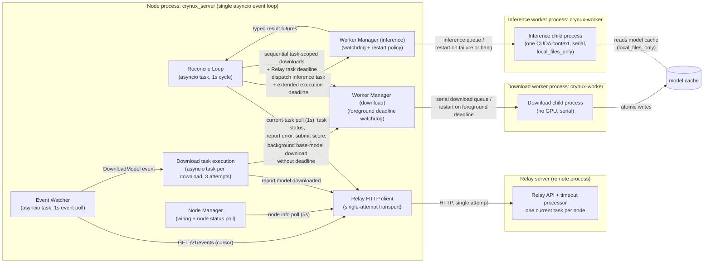
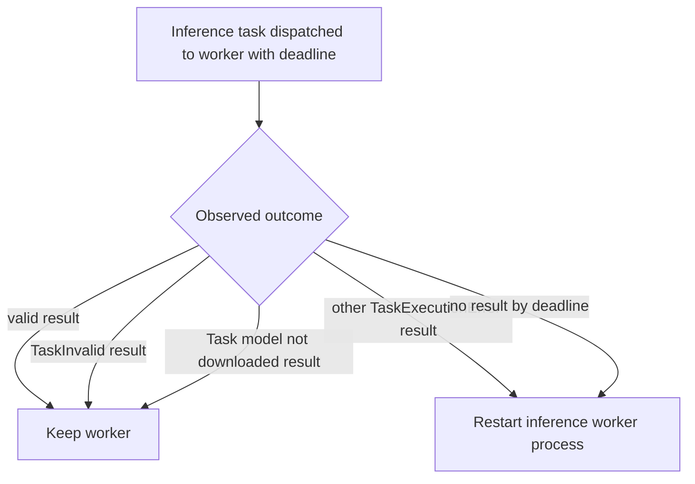

# Node Task System Design

This document specifies the components involved in task handling on the node, their responsibilities, and the design of all non-protocol failure handling: worker process health, relay communication failures, and containment of unexpected exceptions.

Related documents:

- `docs/task-lifecycle.md` specifies the business-level task lifecycle: the condition-to-action rules the reconcile loop applies at each relay task status, and all failure outcomes.
- `docs/state-tracking.md` specifies how the node stays consistent with the relay: the query system, the event system, and recovery after a node restart.
- `docs/task_error_report.md` specifies the independent Task failure diagnostic channel, local persistence, and Relay reporting contract.

## 1) Design Principles

### State-driven reconciliation

The node drives every inference task with a single reconcile loop. Each cycle reads the current state from the relay, derives at most one action from that state plus the locally persisted artifacts, executes the action to completion, and starts the next cycle.

- An action MUST be derived only from a fresh, successful relay query made in the same cycle, combined with local artifacts. Cached or stale relay state MUST NOT drive any action.
- The outcome of a state-changing relay request is never judged by its response alone. A failed or ambiguous request ends the cycle with a log entry; the next cycle re-derives whatever action the fresh state requires. If the request had actually been applied and only its response was lost, the next cycle observes the already-applied status and moves on.
- There is no retry layer below the loop. Every relay request is a single HTTP attempt; the loop cadence is the only retry mechanism.

### Two failure domains

Every failure the node handles belongs to exactly one of two domains, and every component acts in exactly one domain:

- **Protocol domain — task outcome.** How a task ends with respect to the relay: success, task-fault error report, or timeout abort. Decisions in this domain are business decisions driven by relay state and the task protocol. They are owned by the reconcile loop, with the relay itself as the single timeout authority. The protocol domain is specified in `docs/task-lifecycle.md`.
- **Infrastructure domain — node-local recovery.** Failures of the node's own machinery: a poisoned or hung worker process, relay communication failures, unexpected exceptions inside a cycle. Recovery actions in this domain are purely local: restart the worker process, skip the cycle, contain the exception. They are owned by the worker manager and the reconcile loop's cycle containment. The infrastructure domain is specified in this document.

Rules that keep the two domains separate:

- An infrastructure recovery action MUST NOT issue protocol actions: no error report, no abort, no score or result operation.
- A protocol decision MUST NOT depend on infrastructure state (worker health, restart history), and the protocol path MUST NOT manage processes.
- Failure information crosses the boundary in one direction only: the typed outcome of a task execution (success, `TaskInvalid`, `TaskExecutionError`, `TaskCancelled`) is visible to both domains, and each domain acts on it independently. The reconcile loop performs the protocol action; the worker manager performs the local recovery. Neither waits for or triggers the other.
- The diagnostic channel MUST observe failures from both domains without issuing or changing any protocol action. Diagnostic persistence and delivery failures MUST be logged and MUST NOT alter reconciliation, Worker recovery, Task status, QoS, settlement, validation, or slashing.

## 2) Components and Responsibilities

- **Relay (server side)**: the sole authority for ending timed-out tasks, and the sole dispatcher. Its timeout processor periodically scans all non-terminal tasks and sets every task whose `start_time + timeout` has passed to `EndAborted` with reason `Timeout`. The relay maintains one current-task pointer per node (`CurrentTaskIDCommitment`) and refuses to dispatch a new inference task while the pointer is set, so a node has at most one inference task at any time. The pointer is exposed through `GET /v1/node/:address/task`.
- **Reconcile Loop** (`src/crynux_server/task/`): the single driver of all inference task behavior. One asyncio task that polls the node's current task every second and applies the condition-to-action rules in `docs/task-lifecycle.md`. It MUST contain any exception escaping a cycle: a cycle failure MUST NOT terminate the loop.
- **Worker Manager** (`src/crynux_server/worker_manager/`): owns the worker processes. Two instances exist, one per worker role. The inference manager converts worker error results into typed exceptions (`TaskInvalid`, `TaskExecutionError`) and restarts the inference worker process on execution errors and missed inference deadlines. The download manager serializes both foreground task-scoped downloads and background base-model downloads. It MUST watch only jobs that carry a deadline and MUST restart the download worker when such a deadline expires. Background jobs carry no deadline and MUST NOT independently trigger a restart. Each worker connects with its role in the websocket handshake and is routed to the matching manager; inference tasks are dispatched to the inference manager, and both download paths are dispatched to the download manager. Neither manager performs any relay operation.
- **Relay HTTP client** (`src/crynux_server/relay/web_impl.py`): a thin transport layer. Every request is a single attempt; transport errors and all HTTP error responses propagate to the caller unchanged. It contains no retry, backoff, or error-resolution logic.
- **Event Watcher** (`src/crynux_server/watcher/watcher.py`): polls the relay event stream and dispatches `DownloadModel` events, the only channel for background base-model pre-download commands, and node status display events. It plays no role in inference task handling; foreground non-base-model downloads are derived by the reconcile loop from the authoritative task record.
- **Node Manager** (`src/crynux_server/node_manager/`): wires components together and synchronizes node status for display.
- **Task Error Reporter** (`src/crynux_server/task/error_report.py`): persists at most one diagnostic record per Node Address and Task ID Commitment in `task_error_reports.json` under the configured log directory. It writes through a locked temporary-file replacement, restores pending records after restart, and sends them to Relay one at a time. It removes a record only after Relay acknowledgment and stops a reporting pass on the first failure. Automatic reporting runs only when configured; manual reporting uses the same serialized flush operation.
- **Worker Processes** (`crynux-worker`): two independent worker processes, each a supervisor with a single child process selected by the required `worker_role` config (`inference` or `download`). The inference worker executes inference tasks sequentially in a single CUDA context and never downloads models: all model loads run with `local_files_only`, and a model absent from the local cache fails the task with the `Task model not downloaded` error. The download worker downloads models serially and uses no GPU. The server MUST dispatch requested downloads without inspecting the Hugging Face cache; the download worker MUST make repeated requests idempotent. The two workers do not coordinate through any lock: the Hugging Face cache writes files atomically (download to a temporary file, then move), so the inference worker never observes a half-written model file; a partially present snapshot fails the `local_files_only` load and converges once the download completes. Each child reports success or an error traceback per task and keeps running after task failures.

The diagram shows the component topology. Four OS processes exist: the relay server, the node process (`crynux_server`, a Python asyncio program in which every component below runs as an object or asyncio task inside one event loop), the inference worker process, and the download worker process.

## 3) The Reconcile Loop

The loop is the only component that issues protocol actions, and every relay-facing failure mode is handled by its cycle structure. Each cycle:

1. Query the node's current task (`GET /v1/node/:address/task`). If the query fails, end the cycle and sleep one second.
2. If the pointer no longer refers to a task the node is still tracking locally as open — because it moved to another task or was cleared — fetch that task's status once by id and close it locally. If the query returned no task, end the cycle; otherwise continue with the task the pointer refers to.
3. Fetch the current task's status (`GET /v1/inference_tasks/:task_id_commitment`).
4. Derive at most one action from the status and the local artifacts, per the condition-to-action rules in `docs/task-lifecycle.md`.
5. Execute the action and await its completion, then end the cycle.

Rules:

- **Serial execution.** At most one action is in flight at any time; the loop awaits each action before starting the next cycle. The execute action first performs all required foreground downloads sequentially, then dispatches inference. Each foreground download wait is bounded by the Relay task deadline, and the inference wait is bounded by the extended execution deadline in section 4. Every other action is a single HTTP request.
- **Failure handling.** Any relay request failure — transport error, 5xx, or 4xx — ends the cycle with a log entry. No local state advances on a failed request. A 4xx caused by a duplicated write (first response lost, action re-derived) converges on the next cycle, when the fresh status shows the operation already applied. The loop contains no per-operation retry, no sleeps inside actions, and no error-message pattern matching.
- **Exception containment.** An unexpected exception inside a cycle is logged and MUST NOT terminate the loop or affect other cycles.
- **Discovery and recovery.** Task discovery is the current-task poll itself. The first cycle after node startup is identical to every other cycle; there is no separate recovery flow. Local artifacts persisted before the restart determine which actions are skipped (see `docs/state-tracking.md`).
- **No node-issued aborts.** The loop MUST NOT call the relay abort endpoint. A task the node can no longer act on is closed locally and left to the relay's timeout processor.

## 4) Worker Process Health

The inference child shares one CUDA context across all inference tasks. A failure in one task can permanently poison this context (for example, a sticky CUDA device-side assert), causing every subsequent task to fail until the process is restarted. A hung worker has the same effect through a different symptom.

The inference health policy is owned by the inference worker manager. The download worker manager applies a separate deadline policy to foreground task-scoped downloads: it MUST restart the download worker when a foreground job produces no worker-reported result by the Relay task deadline. The restart MUST cancel the in-flight and queued download futures, including any background job currently ahead of the foreground job. Background jobs MUST NOT register a deadline and MUST NOT trigger this policy. Download worker results, including foreground failures, MUST NOT trigger a restart.

The inference worker manager monitors worker health on its own authority, using only information it observes directly. The restart decision does not depend on relay events, relay task statuses, or the reconcile loop.

- When an inference task result resolves to `TaskExecutionError`, the worker manager MUST restart the inference worker process immediately, with one exception: an error result whose traceback contains `Task model not downloaded` MUST NOT trigger a restart. That failure means a required model is absent from the local cache; the worker and its CUDA context are healthy, and restarting them while the model downloads is pure waste. The relay does not dispatch a new task to the node until the current task ends, so a restart happens in a quiet window.
- Every inference task dispatched to the worker carries an execution deadline of the task timeout plus 10 seconds. When a dispatched task has produced no worker-reported result by its deadline, the worker manager MUST restart the inference worker process. This deadline is the only bound on the reconcile loop's execute wait: by the time it fires, the relay's own timeout processor has already aborted the task, so the cycle that resumes after the cancellation observes a terminal status and closes the task.
- The watchdog judges completion by results the worker actually reports (success or error), never by the local task future state. A task future cancelled from the caller side does not count as a result; the watchdog entry is cleared only by a worker-reported result or by a worker restart.
- The worker MUST NOT be restarted for `TaskInvalid` results (the task is at fault, the worker is healthy), for `Task model not downloaded` results, for successful results, or for tasks that were never dispatched to the worker.
- An inference worker restart cancels the in-flight and queued task futures of the inference manager only; download tasks are unaffected. An inference task whose execution is cancelled this way ends through the `TaskCancelled` path specified in `docs/task-lifecycle.md`; a cancelled execution MUST NOT trigger another worker restart.
- Every Worker future MUST be registered when queued and MUST track its `queued`, `dispatched`, and `sent` phase. Cancellation MUST carry the initiating component, typed reason, Worker role and identity, phase, deadline, cancellation time, and whether the deadline was reached. Deadline expiration MUST mark the expired future as `WorkerTaskTimeout` before restarting the Worker; other futures interrupted by that restart MUST be marked `WorkerRestarted`. WebSocket disconnect MUST mark unfinished futures as `WorkerDisconnected`. Runner version synchronization and whole-process shutdown MUST use distinct cancellation reasons and MUST NOT create diagnostic records.

For a foreground download, a worker-reported failure, cancellation caused by a download worker restart, or an already expired Relay task deadline MUST become `TaskExecutionError` for the owning inference task. The reconciler MUST NOT dispatch inference after any of these outcomes.

The two failure modes map to the two triggers:

- **Fast failure** (poisoned CUDA context): the worker returns a `TaskExecutionError` result and is restarted immediately.
- **Hang**: the worker never returns a result; the watchdog restarts it at the task deadline.

Worker health state is process-local. A node restart replaces both worker processes, so nothing persists across restarts.

## 5) Model Download Tasks

The node has two download paths that share one serial download worker.

### Background base-model pre-download

- A relay-emitted `DownloadModel` event MUST create one local background download task for its base model. These commands are not relay task records: they have no relay-side status, no timeout, and do not occupy the node's current-task pointer.
- The background job MUST carry no deadline. It MUST use the persisted lifecycle, bounded retry, recovery, relay reporting, and local model-reporting cache specified in `docs/model_predownload.md`.
- Commands emitted while the node is offline are lost with the rest of the event stream. This is accepted because base-model pre-download is a best-effort locality optimization.

### Foreground task-scoped download

- For each inference task execution, `TaskReconciler` MUST read the authoritative `task.model_ids` from the Relay task record and derive every identifier that is not prefixed with `base:`. It MUST preserve Relay order and send one task-scoped `DownloadTaskInput` job at a time to the download worker before dispatching inference.
- Each foreground job MUST carry the actual Relay task deadline, `start_time + timeout`, without the inference execution grace period. All foreground jobs for the task share this deadline.
- The server MUST NOT inspect the Hugging Face cache or skip a job based on server-side cache state. The download worker's idempotence MUST handle a model that is already present.
- Foreground jobs MUST NOT use the background download state machine, retries, recovery, relay model-download report, or `download_model_cache`.
- A worker-reported download failure, cancellation, or expired deadline MUST become the inference task's local `TaskExecutionError`. Inference MUST NOT start. The node MUST close the task locally without a Relay error report, and the Relay timeout processor MUST close it authoritatively.

Both paths use the same serial download queue. A background download MAY run concurrently with inference, while every foreground download for an inference task MUST complete before that task's inference begins. There is no cache lock between the two workers; atomic cache writes prevent inference from reading a half-written file. Inference remains local-files-only and MUST NOT download a model itself.

## 6) State Consistency with the Relay

The node tracks task and node state through the relay query system as the authoritative source, with the relay event system carrying only background base-model pre-download commands and display hints. Foreground download requirements are derived from the authoritative inference task query. Recovery after a node restart is the reconcile loop's normal operation over persisted local artifacts. This design, including the rules for adding new behavior on either channel, is specified in `docs/state-tracking.md`.
