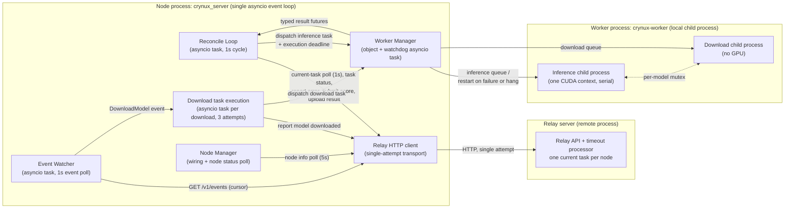
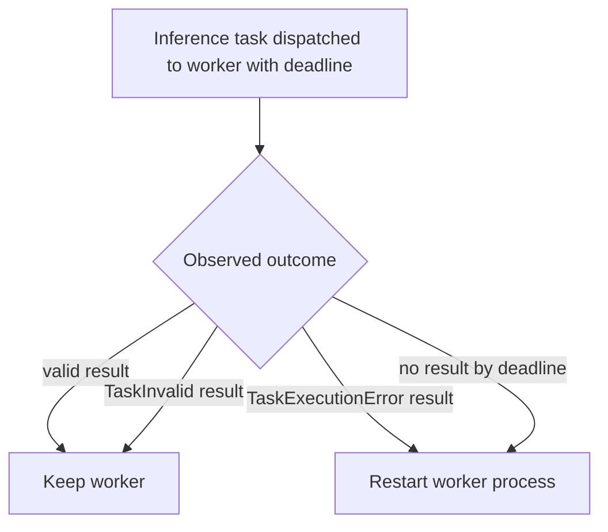

# Node Task System Design

This document specifies the components involved in task handling on the node, their responsibilities, and the design of all non-protocol failure handling: worker process health, relay communication failures, and containment of unexpected exceptions.

Related documents:

- `docs/task-lifecycle.md` specifies the business-level task lifecycle: the condition-to-action rules the reconcile loop applies at each relay task status, and all failure outcomes.
- `docs/state-tracking.md` specifies how the node stays consistent with the relay: the query system, the event system, and recovery after a node restart.

## 1) Design Principles

### State-driven reconciliation

The node drives every inference task with a single reconcile loop. Each cycle reads the current state from the relay, derives at most one action from that state plus the locally persisted artifacts, executes the action to completion, and starts the next cycle.

- An action MUST be derived only from a fresh, successful relay query made in the same cycle, combined with local artifacts. Cached or stale relay state MUST NOT drive any action.
- The outcome of a state-changing relay request is never judged by its response alone. A failed or ambiguous request ends the cycle with a log entry; the next cycle re-derives whatever action the fresh state requires. If the request had actually been applied and only its response was lost, the next cycle observes the already-applied status and moves on.
- There is no retry layer below the loop. Every relay request is a single HTTP attempt; the loop cadence is the only retry mechanism.

### Two failure domains

Every failure the node handles belongs to exactly one of two domains, and every component acts in exactly one domain:

- **Protocol domain — task outcome.** How a task ends with respect to the relay: success, task-fault error report, or timeout abort. Decisions in this domain are business decisions driven by relay state and the task protocol. They are owned by the reconcile loop, with the relay itself as the single timeout authority. The protocol domain is specified in `docs/task-lifecycle.md`.
- **Infrastructure domain — node-local recovery.** Failures of the node's own machinery: a poisoned or hung worker process, relay communication failures, unexpected exceptions inside a cycle. Recovery actions in this domain are purely local: restart the worker process, skip the cycle, contain the exception. They are owned by the worker manager and the reconcile loop's cycle containment. The infrastructure domain is specified in this document.

Rules that keep the two domains separate:

- An infrastructure recovery action MUST NOT issue protocol actions: no error report, no abort, no score or result operation.
- A protocol decision MUST NOT depend on infrastructure state (worker health, restart history), and the protocol path MUST NOT manage processes.
- Failure information crosses the boundary in one direction only: the typed outcome of a task execution (success, `TaskInvalid`, `TaskExecutionError`, `TaskCancelled`) is visible to both domains, and each domain acts on it independently. The reconcile loop performs the protocol action; the worker manager performs the local recovery. Neither waits for or triggers the other.

## 2) Components and Responsibilities

- **Relay (server side)**: the sole authority for ending timed-out tasks, and the sole dispatcher. Its timeout processor periodically scans all non-terminal tasks and sets every task whose `start_time + timeout` has passed to `EndAborted` with reason `Timeout`. The relay maintains one current-task pointer per node (`CurrentTaskIDCommitment`) and refuses to dispatch a new inference task while the pointer is set, so a node has at most one inference task at any time. The pointer is exposed through `GET /v1/node/:address/task`.
- **Reconcile Loop** (`src/crynux_server/task/`): the single driver of all inference task behavior. One asyncio task that polls the node's current task every second and applies the condition-to-action rules in `docs/task-lifecycle.md`. It MUST contain any exception escaping a cycle: a cycle failure MUST NOT terminate the loop.
- **Worker Manager** (`src/crynux_server/worker_manager/`): owns the worker process. It converts worker error results into typed exceptions (`TaskInvalid`, `TaskExecutionError`) and restarts the worker process on its own authority, based only on task execution outcomes it observes directly. It MUST NOT perform any relay operation.
- **Relay HTTP client** (`src/crynux_server/relay/web_impl.py`): a thin transport layer. Every request is a single attempt; transport errors and all HTTP error responses propagate to the caller unchanged. It contains no retry, backoff, or error-resolution logic.
- **Event Watcher** (`src/crynux_server/watcher/watcher.py`): polls the relay event stream and dispatches `DownloadModel` events (the only channel for model download commands) and node status display events. It plays no role in inference task handling.
- **Node Manager** (`src/crynux_server/node_manager/`): wires components together and synchronizes node status for display.
- **Worker Process** (`crynux-worker`): a supervisor process with two child processes. The inference child executes inference tasks sequentially in a single CUDA context. The download child downloads models and uses no GPU. The two children run in parallel and coordinate through a per-model mutex, so a model file is never read by an inference while it is being written by a download. Each child reports success or an error traceback per task and keeps running after task failures.

The diagram shows the component topology. Three OS processes exist: the relay server, the node process (`crynux_server`, a Python asyncio program in which every component below runs as an object or asyncio task inside one event loop), and the worker process with its two children.

## 3) The Reconcile Loop

The loop is the only component that issues protocol actions, and every relay-facing failure mode is handled by its cycle structure. Each cycle:

1. Query the node's current task (`GET /v1/node/:address/task`). If the query fails, end the cycle and sleep one second.
2. If the pointer no longer refers to a task the node is still tracking locally as open — because it moved to another task or was cleared — fetch that task's status once by id and close it locally. If the query returned no task, end the cycle; otherwise continue with the task the pointer refers to.
3. Fetch the current task's status (`GET /v1/inference_tasks/:task_id_commitment`).
4. Derive at most one action from the status and the local artifacts, per the condition-to-action rules in `docs/task-lifecycle.md`.
5. Execute the action and await its completion, then end the cycle.

Rules:

- **Serial execution.** At most one action is in flight at any time; the loop awaits each action before starting the next cycle. The execute action's wait is bounded by the worker manager's execution deadline (section 4); every other action is a single HTTP request.
- **Failure handling.** Any relay request failure — transport error, 5xx, or 4xx — ends the cycle with a log entry. No local state advances on a failed request. A 4xx caused by a duplicated write (first response lost, action re-derived) converges on the next cycle, when the fresh status shows the operation already applied. The loop contains no per-operation retry, no sleeps inside actions, and no error-message pattern matching.
- **Exception containment.** An unexpected exception inside a cycle is logged and MUST NOT terminate the loop or affect other cycles.
- **Discovery and recovery.** Task discovery is the current-task poll itself. The first cycle after node startup is identical to every other cycle; there is no separate recovery flow. Local artifacts persisted before the restart determine which actions are skipped (see `docs/state-tracking.md`).
- **No node-issued aborts.** The loop MUST NOT call the relay abort endpoint. A task the node can no longer act on is closed locally and left to the relay's timeout processor.

## 4) Worker Process Health

The inference child shares one CUDA context across all inference tasks. A failure in one task can permanently poison this context (for example, a sticky CUDA device-side assert), causing every subsequent task to fail until the process is restarted. A hung worker has the same effect through a different symptom.

The worker manager monitors worker health on its own authority, using only information it observes directly. The restart decision does not depend on relay events, relay task statuses, or the reconcile loop.

- When an inference task result resolves to `TaskExecutionError`, the worker manager MUST restart the worker process immediately. The relay does not dispatch a new task to the node until the current task ends, so the restart happens in a quiet window.
- Every inference task dispatched to the worker carries an execution deadline of the task timeout plus 10 seconds. When a dispatched task has produced no worker-reported result by its deadline, the worker manager MUST restart the worker process. This deadline is the only bound on the reconcile loop's execute wait: by the time it fires, the relay's own timeout processor has already aborted the task, so the cycle that resumes after the cancellation observes a terminal status and closes the task.
- The watchdog judges completion by results the worker actually reports (success or error), never by the local task future state. A task future cancelled from the caller side does not count as a result; the watchdog entry is cleared only by a worker-reported result or by a worker restart.
- The worker MUST NOT be restarted for `TaskInvalid` results (the task is at fault, the worker is healthy), for successful results, or for tasks that were never dispatched to the worker.
- A worker restart cancels all in-flight and queued task futures of both children. An inference task whose execution is cancelled this way ends through the `TaskCancelled` path specified in `docs/task-lifecycle.md`; a cancelled execution MUST NOT trigger another worker restart. A download task cancelled this way is recovered by the download path's own retries (section 5).

The two failure modes map to the two triggers:

- **Fast failure** (poisoned CUDA context): the worker returns a `TaskExecutionError` result and is restarted immediately.
- **Hang**: the worker never returns a result; the watchdog restarts it at the task deadline.

Worker health state is process-local. A node restart replaces the worker process, so nothing persists across restarts.

## 5) Model Download Tasks

Model download commands are relay-emitted `DownloadModel` events, not relay task records: they have no relay-side status, no timeout, and do not occupy the node's current-task pointer. The relay emits them to the assigned node when a started task requires a model the node lacks, and to idle nodes to spread under-replicated models. A download can therefore run while an inference task is active.

- Each `DownloadModel` event creates one local download task, executed through the worker manager on the worker's download child process. Downloads run in parallel with inference execution and never queue behind it; the per-model mutex is the only synchronization point between the two children.
- A download task is attempted up to 3 times with backoff; after exhaustion it is marked failed locally. On success the node reports the model as downloaded to the relay.
- A worker restart triggered by inference health cancels an in-flight download; the download's own retry covers this.
- Download commands emitted while the node is offline are lost with the rest of the event stream. This is accepted: downloads are a best-effort locality optimization.

## 6) State Consistency with the Relay

The node tracks task and node state through the relay query system as the authoritative source, with the relay event system carrying only the flows that have no query equivalent (model download commands) and display hints. Recovery after a node restart is the reconcile loop's normal operation over persisted local artifacts. This design, including the rules for adding new behavior on either channel, is specified in `docs/state-tracking.md`.
